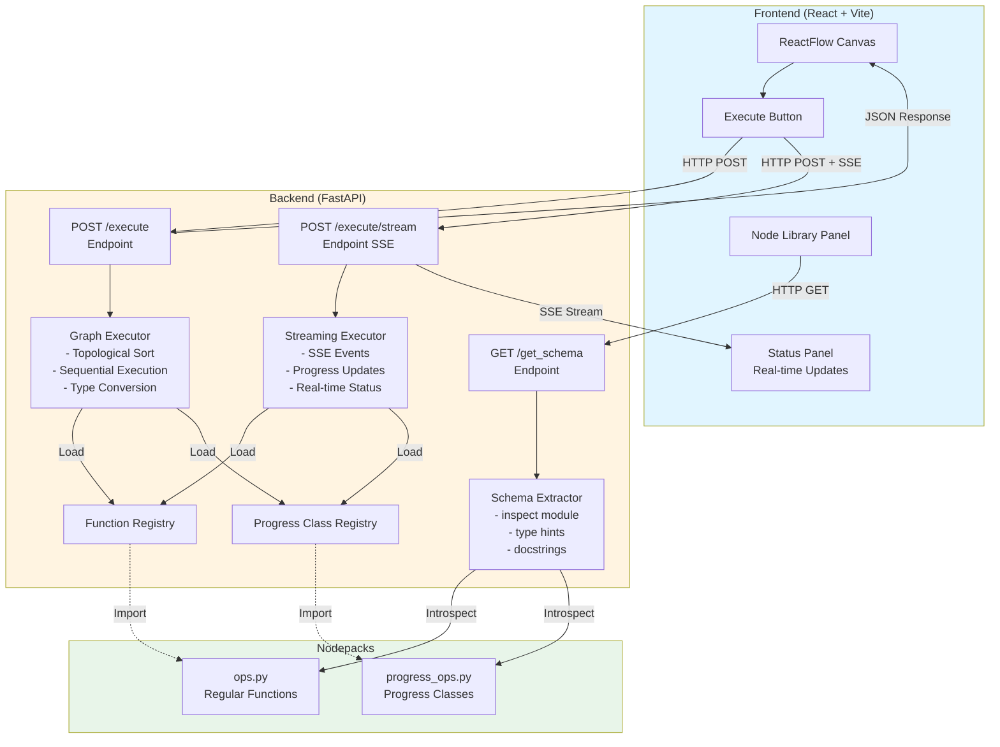
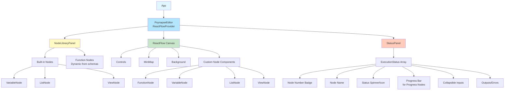
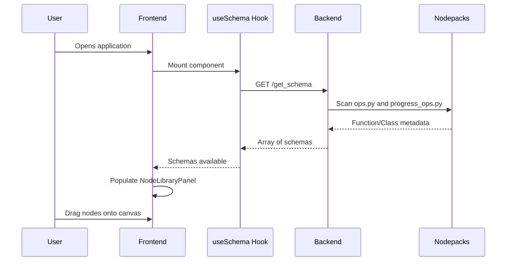
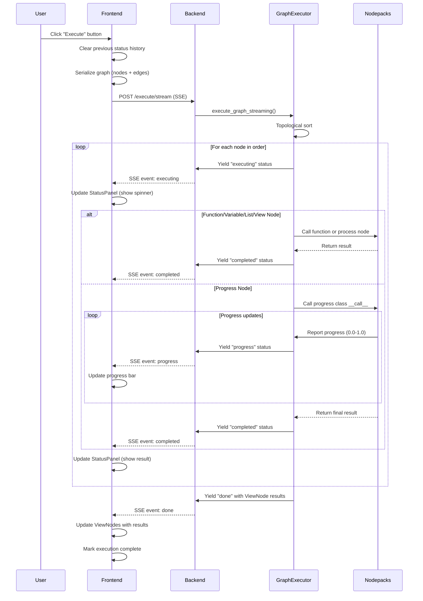
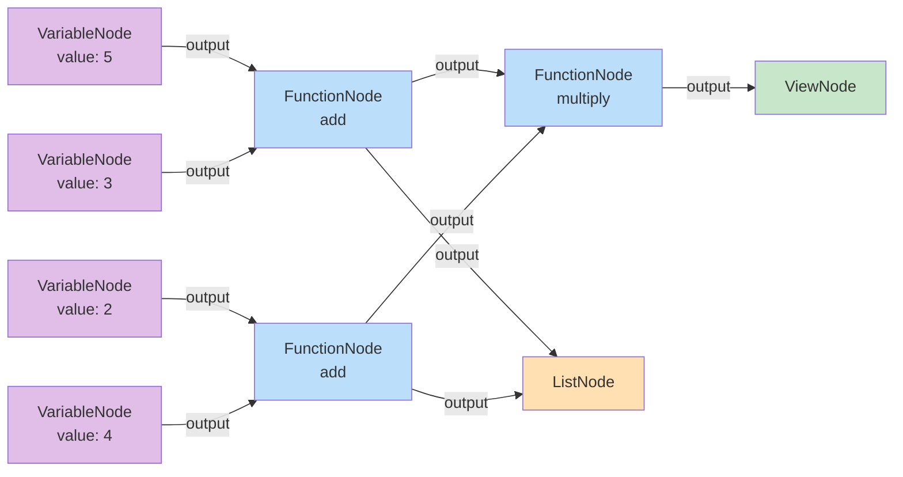

# Psynapse Architecture Documentation

## Overview

Psynapse is a full-stack node-based workflow editor that enables visual programming through a drag-and-drop interface. The system consists of three main components:

1. **Backend (FastAPI)**: Handles schema extraction from Python functions and executes node graphs
2. **Frontend (React + React Flow)**: Provides visual node graph editor with drag-and-drop functionality
3. **Nodepacks**: Python modules containing executable functions

## System Architecture



## Backend Architecture

### 1. Schema Extraction (`schema_extractor.py`)

**Purpose**: Dynamically discover and extract metadata from Python functions and classes in nodepacks.

**Process**:
1. Scan `nodepacks/` directory for all `ops.py` and `progress_ops.py` files
2. Load each module dynamically using `importlib`
3. For each function in `ops.py`:
   - Extract function signature using `inspect.signature()`
   - Parse type hints using `typing.get_type_hints()`
   - Extract docstrings using `inspect.getdoc()`
   - Detect `Literal` type hints for dropdown UI controls
   - Build JSON schema with parameters, defaults, and return types
4. For each class in `progress_ops.py`:
   - Extract `__call__` method signature (skip private classes starting with `_`)
   - Parse type hints from `__call__` method (excluding `self` parameter)
   - Extract docstrings from class or `__call__` method
   - Detect `Literal` type hints for dropdown UI controls
   - Build JSON schema with `is_progress_node: true` flag

**Output Schema**:
```json
{
  "name": "function_name",
  "params": [
    {
      "name": "param1",
      "type": "float"
    },
    {
      "name": "param2",
      "type": "int",
      "default": 10
    },
    {
      "name": "mode",
      "type": "Literal",
      "literal_values": ["fast", "slow", "medium"]
    }
  ],
  "returns": [
    {"name": "result", "type": "float"}
  ],
  "docstring": "Function description...",
  "filepath": "/path/to/ops.py",
  "is_progress_node": false
}
```

### 2. Graph Executor (`executor.py`)

**Purpose**: Execute node graphs in the correct order with dependency resolution.

**Key Components**:
- **Function Registry**: Dictionary mapping function names to callable functions from `ops.py`
- **Progress Class Registry**: Dictionary mapping class names to classes from `progress_ops.py`

#### Topological Sorting (Kahn's Algorithm)
```python
1. Calculate in-degree for each node (count of incoming edges)
2. Initialize queue with nodes having in-degree = 0
3. While queue is not empty:
   a. Dequeue node and add to sorted list
   b. For each neighbor, decrease in-degree by 1
   c. If neighbor's in-degree becomes 0, enqueue it
4. If sorted list size ≠ total nodes, graph has cycle (raises ValueError)
```

#### Node Execution Flow

The executor supports four node types, each with distinct behavior:

1. **FunctionNode** (from `ops.py`):
   - Gather inputs: First use node data (default values), then override with connected edge values
   - Type conversion: Automatically convert string inputs to appropriate types (int, float, str, bool)
   - Function call: Execute corresponding Python function with converted inputs
   - Store output for downstream nodes

2. **VariableNode**:
   - Output stored value based on `variableType`: String, Number, Boolean, List, Object, Image
   - Support for LLM message formatting:
     - `llmMessageFormat`: Wraps output as `{"role": "<role>", "content": "<value>"}`
     - `textContentFormat`: Wraps as `{"type": "text", "content": "<value>"}` (legacy)
     - `imageContentFormat`: For image data URLs with optional LLM message format
   - Type conversion: Parse strings to numbers/booleans, JSON strings to objects, etc.

3. **ListNode**:
   - Aggregates values from multiple connected inputs into a single list
   - Input order preserved via indexed handles (`input-0`, `input-1`, etc.)
   - Outputs Python list of collected values

4. **ViewNode**:
   - Receive single input from connected edge
   - Store value for display (no processing)
   - Results returned in API response

5. **Progress Nodes** (from `progress_ops.py`):
   - Instantiate progress-aware class
   - Set up `_progress_reporter` with callback mechanism
   - Execute `__call__` method in separate thread
   - Stream progress updates via callback during execution
   - Progress format: `{percent: 0.0-1.0, message: "..."}`
   - Store output when complete

#### Error Handling
- Type conversion errors (caught and logged)
- Missing functions/classes in registries
- Function execution exceptions (output set to None)
- Thread execution errors for progress nodes
- Cycle detection in graph (raises ValueError)

#### Environment Variables
- Accepts optional `env_vars` parameter
- Temporarily sets environment variables during execution
- Restores original values after completion

### 3. API Endpoints (`main.py`)

**Initialization**:
- Uses FastAPI lifespan events to initialize GraphExecutor on startup
- Loads nodepacks from `NODEPACKS_DIR` environment variable (default: `./nodepacks`)
- Populates function and progress class registries on startup

**Endpoints**:

#### GET `/`
- Health check endpoint
- Returns: `{"message": "Psynapse Backend API"}`

#### GET `/get_schema`
- Extracts and returns schemas for all functions/classes in nodepacks
- Calls `extract_all_schemas()` to scan all `ops.py` and `progress_ops.py` files
- Used by frontend on startup to populate node library
- Response: Array of schema objects (see Schema Extraction section)

#### POST `/execute`
- Accepts: `ExecuteRequest` with `nodes`, `edges`, and optional `env_vars`
- Executes graph using `GraphExecutor.execute_graph()`
- Returns: ViewNode results only
- Response format: `{"results": {"view_node_id": value}}`
- Traditional single-response execution (no streaming)

#### POST `/execute/stream`
- Accepts: `ExecuteRequest` with `nodes`, `edges`, and optional `env_vars`
- Streams execution status via Server-Sent Events (SSE)
- Provides real-time updates as nodes execute
- Response headers include `Cache-Control: no-cache` and `X-Accel-Buffering: no`
- Returns status for each node: `executing` → `completed`/`error`
- Progress nodes also emit `progress` status during execution
- Final event contains ViewNode results

**SSE Event Format:**
```json
data: {"node_id":"node_1","node_number":1,"node_name":"add","status":"executing","inputs":{"a":"5","b":"10"}}

data: {"node_id":"node_1","node_number":1,"node_name":"add","status":"completed","inputs":{"a":"5","b":"10"},"output":15}

data: {"status":"done","results":{"view_node_id":15}}
```

**Progress Node Event Format:**
```json
data: {"node_id":"node_2","node_number":2,"node_name":"ProgressOp","status":"executing","inputs":{"count":10}}

data: {"node_id":"node_2","node_number":2,"node_name":"ProgressOp","status":"progress","progress":0.3,"progress_message":"Processing item 3/10","inputs":{"count":10}}

data: {"node_id":"node_2","node_number":2,"node_name":"ProgressOp","status":"progress","progress":0.6,"progress_message":"Processing item 6/10","inputs":{"count":10}}

data: {"node_id":"node_2","node_number":2,"node_name":"ProgressOp","status":"completed","inputs":{"count":10},"output":90}
```

**Error Event Format:**
```json
data: {"node_id":"node_3","node_number":3,"node_name":"divide","status":"error","inputs":{"a":10,"b":0},"error":"division by zero"}

data: {"status":"error","error":"Graph contains a cycle"}
```

#### CLI Commands
The backend includes a Typer CLI with the `run` command:
```bash
psynapse-backend run --host 0.0.0.0 --port 8000 --reload --nodepack-dir ./nodepacks
```

#### CORS Configuration
- Allows all origins (`*`) - should be restricted in production
- Allows credentials, all methods, and all headers

## Frontend Architecture

### Component Hierarchy



### Key Components

#### 1. PsynapseEditor (`PsynapseEditor.tsx`)

**Responsibilities**:
- Manage React Flow state (nodes, edges)
- Handle drag-and-drop from library panel
- Coordinate graph execution via streaming SSE
- Update ViewNodes with results
- Manage execution status and history

**State Management**:
```typescript
- nodes: Node[]                    // All nodes on canvas
- edges: Edge[]                    // All connections
- reactFlowInstance                // React Flow API
- executing: boolean               // Execution status flag
- statusHistory: ExecutionStatus[] // Real-time execution updates
- abortExecution: (() => void)     // Cleanup function for aborting SSE stream
```

**Key Functions**:
- `onDrop`: Create new node from dragged library item (FunctionNode, VariableNode, ListNode, ViewNode)
- `executeGraph`: Serialize graph and stream execution from backend via SSE
- `handleNodeDataChange`: Update node input values and properties
- Node type registry: Maps node types to their React components

**Execution Flow**:
1. User clicks "Execute" button
2. Clears previous status history
3. Calls `api.executeGraphStreaming()` with status update callback
4. Receives real-time status updates via SSE
5. Updates `statusHistory` state as nodes execute
6. Shows progress bars for progress nodes
7. Updates ViewNodes with final results
8. Handles errors and displays them in StatusPanel

#### 2. NodeLibraryPanel (`NodeLibraryPanel.tsx`)

**Responsibilities**:
- Fetch schemas from backend on mount using `useSchema` hook
- Display built-in nodes (VariableNode, ListNode, ViewNode)
- Display draggable function nodes from schemas
- Handle drag events for all node types

**Built-in Nodes**:
- **Variable**: Stores values (String, Number, Boolean, List, Object, Image)
- **List**: Aggregates multiple inputs into array
- **View**: Displays output values

**Drag Data Format**:
```typescript
{
  type: 'functionNode' | 'variableNode' | 'listNode' | 'viewNode',
  schema?: FunctionSchema  // For function nodes
}
```

#### 3. FunctionNode (`FunctionNode.tsx`)

**Features**:
- Input handles for each parameter (only if no default value)
- Input fields with type-appropriate controls:
  - Text inputs for strings
  - Number inputs for int/float
  - Checkboxes for booleans
  - Dropdowns for Literal types
- Single output handle
- Real-time value updates via node data changes

**Styling**:
- Blue border and handles
- White background
- Parameters without defaults show as input handles
- Parameters with defaults show only in properties panel

#### 4. VariableNode (`VariableNode.tsx`)

**Features**:
- No input handles (self-contained value storage)
- Single output handle
- Type selector: String, Number, Boolean, List, Object, Image
- Value input appropriate to selected type
- LLM message formatting options:
  - `llmMessageFormat`: Wraps as `{"role": "<role>", "content": "<value>"}`
  - Role selector for LLM messages (user, assistant, system)
- Image upload support with data URL storage

**Styling**:
- Purple border and handles
- White background
- Type-specific input controls

#### 5. ListNode (`ListNode.tsx`)

**Features**:
- Multiple indexed input handles (`input-0`, `input-1`, etc.)
- Single output handle
- Dynamically adds input handles as needed
- Aggregates all connected inputs into array
- Preserves input order

**Styling**:
- Orange border and handles
- White background
- Shows number of connected inputs

#### 6. ViewNode (`ViewNode.tsx`)

**Features**:
- Single input handle
- Display area for value (supports complex objects/arrays)
- No output handles
- Updates after execution with final results
- JSON pretty-printing for complex values

**Styling**:
- Green border and handles
- Light green background
- Monospace font for values
- Scrollable content area

#### 7. StatusPanel (`StatusPanel.tsx`)

**Features**:
- Real-time execution monitoring via SSE stream
- Displays nodes in execution order (numbered badges)
- Status indicators:
  - Animated spinner for `executing` nodes
  - Progress bar for `progress` nodes (shows percentage and message)
  - Green checkmark for `completed` nodes
  - Red X for `error` nodes
- Collapsible inputs section (click to expand/collapse)
- Output/error display with JSON pretty-printing
- Scrollable history
- Auto-scrolls to latest status update

**Styling**:
- Fixed 400px width on right side
- Color-coded status borders:
  - Blue for executing
  - Orange for progress
  - Green for completed
  - Red for error
- White cards with colored left borders
- Monospace font for input/output values

**State Updates**:
- Receives `ExecutionStatus[]` from parent PsynapseEditor
- Updates in real-time as SSE events arrive
- Shows execution progress visually with progress bars
- Clears on new execution

### Data Flow

#### 1. Initialization Flow


#### 2. Execution Flow (Streaming SSE)


#### 3. Node Type Data Flow

**FunctionNode**:
```
Input: Node data (defaults) + Connected edges (overrides)
  → Type conversion (str → int/float/bool)
  → Function execution
  → Output stored in node_outputs dict
```

**VariableNode**:
```
Input: variableValue + variableType + formatting options
  → Type conversion based on variableType
  → Apply LLM message formatting if enabled
  → Output stored in node_outputs dict
```

**ListNode**:
```
Input: Multiple connected edges with indexed handles (input-0, input-1, ...)
  → Sort inputs by index
  → Aggregate into Python list
  → Output stored in node_outputs dict
```

**ViewNode**:
```
Input: Single connected edge
  → Pass through value
  → Store in view_node_results dict
  → Return in final API response
```

**Progress Node**:
```
Input: Node data + Connected edges
  → Instantiate progress class
  → Set up _progress_reporter callback
  → Execute in separate thread
  → Yield progress updates (0.0-1.0 + message)
  → Store final output in node_outputs dict
```

## Node Graph Execution Details

### Example Graph



### Execution Steps

1. **Topological Sort**:
   ```
   Order: V1 → V2 → V3 → V4 → F1(add) → F2(add) → L1(list) → F3(multiply) → View
   ```

2. **Sequential Execution**:
   ```
   V1: output = 5
   V2: output = 3
   V3: output = 2
   V4: output = 4
   F1(add): inputs = {a: 5, b: 3} → result = 8
   F2(add): inputs = {a: 2, b: 4} → result = 6
   L1(list): inputs = [8, 6] → result = [8, 6]
   F3(multiply): inputs = {a: 8, b: 6} → result = 48
   View: input = 48 → display = 48
   ```

3. **SSE Events Sequence**:
   ```json
   // Variable nodes
   {"node_id":"V1","node_number":1,"node_name":"Variable","status":"executing","inputs":{}}
   {"node_id":"V1","node_number":1,"node_name":"Variable","status":"completed","inputs":{},"output":5}

   // ... (V2, V3, V4 similar)

   // Function nodes
   {"node_id":"F1","node_number":5,"node_name":"add","status":"executing","inputs":{"a":5,"b":3}}
   {"node_id":"F1","node_number":5,"node_name":"add","status":"completed","inputs":{"a":5,"b":3},"output":8}

   // List node
   {"node_id":"L1","node_number":7,"node_name":"List","status":"executing","inputs":{"input-0":8,"input-1":6}}
   {"node_id":"L1","node_number":7,"node_name":"List","status":"completed","inputs":{"input-0":8,"input-1":6},"output":[8,6]}

   // Final result
   {"status":"done","results":{"view_node_id":"View","value":48}}
   ```

4. **Final Response**:
   ```json
   {
     "results": {
       "View": 48
     }
   }
   ```

## Type System

### Supported Types

Backend and frontend support these types:

#### Primitive Types (for Function Parameters):
- `int`: Integers
- `float`: Floating-point numbers
- `str`: Strings
- `bool`: Booleans
- `Literal[...]`: Dropdown selection (e.g., `Literal["fast", "slow"]`)

#### Variable Node Types:
- **String**: Text values
- **Number**: Integer or floating-point numbers
- **Boolean**: True/False values
- **List**: JSON array (e.g., `[1, 2, 3]`)
- **Object**: JSON object (e.g., `{"key": "value"}`)
- **Image**: Data URL for images (e.g., `data:image/png;base64,...`)

#### Complex Types (via Python functions):
- **dict**: Python dictionaries (from Object variables or function returns)
- **list**: Python lists (from List nodes, List variables, or function returns)
- **Any**: Any Python type (used when type hints are missing)

### Type Conversion

The executor automatically converts input values for function parameters:
```python
if param_type == float and not isinstance(value, float):
    converted_value = float(value)
elif param_type == int and not isinstance(value, (int, bool)):
    converted_value = int(value)
elif param_type == str and not isinstance(value, str):
    converted_value = str(value)
elif param_type == bool and not isinstance(value, bool):
    converted_value = bool(value)
```

### LLM Message Formatting

Variable nodes support special formatting for LLM integration:

**Standard LLM Message Format** (`llmMessageFormat=true`):
```json
{
  "role": "user",
  "content": "Hello, world!"
}
```

**Image Message Format**:
```json
{
  "role": "user",
  "content": [
    {
      "type": "image_url",
      "image_url": {"url": "data:image/png;base64,..."}
    }
  ]
}
```

**Legacy Text Content Format** (`textContentFormat=true`):
```json
{
  "type": "text",
  "content": "Hello, world!"
}
```

## Progress Node Pattern

Progress nodes enable long-running operations to report their status in real-time:

### Implementation Pattern

```python
# In nodepacks/<nodepack>/progress_ops.py

class _ProgressReporter:
    """Internal class for progress reporting."""
    def __init__(self):
        self.callback = None

    def set_callback(self, callback):
        self.callback = callback

    def update(self, current: int, total: int, message: str):
        """Report progress (0.0-1.0) with optional message."""
        if self.callback:
            percent = current / total if total > 0 else 0.0
            self.callback(percent, message)


class MyProgressOperation:
    """
    A progress-aware operation that reports execution status.
    """
    def __init__(self):
        self._progress_reporter = _ProgressReporter()

    def __call__(self, iterations: int) -> str:
        """Execute operation with progress reporting."""
        for i in range(iterations):
            # Do work...
            time.sleep(0.5)

            # Report progress
            self._progress_reporter.update(
                current=i + 1,
                total=iterations,
                message=f"Processing iteration {i + 1}/{iterations}"
            )

        return f"Completed {iterations} iterations"
```

### Threading Model

- Progress nodes execute in separate threads to avoid blocking
- Progress updates sent via queue from thread to main executor
- Main executor yields SSE events while thread is running
- Errors caught in thread and reported via error status

### Frontend Display

- Progress nodes show animated progress bar in StatusPanel
- Progress percentage (0-100%) displayed
- Progress message shown below bar
- Real-time updates as operation executes

## Error Handling

### Backend Errors

**Schema Extraction**:
- Module loading failures (invalid Python syntax, missing dependencies)
- Missing type hints (falls back to `Any` type)
- Invalid class structures (classes without `__call__` ignored)

**Graph Execution**:
- Cycle detection via topological sort (raises `ValueError`)
- Missing functions/classes in registries (node skipped, output set to `None`)
- Type conversion errors (caught, logged, output set to `None`)
- Function execution exceptions (caught, logged, yields error status in streaming)
- Thread execution errors for progress nodes (caught, yields error status)

**API Errors**:
- Invalid request format (400 Bad Request)
- Execution failures (500 Internal Server Error with error details)
- SSE stream errors (error event with status: "error")

### Frontend Errors

**Schema Loading**:
- Network errors (retries with exponential backoff via useSchema hook)
- Invalid response format (empty node library displayed)
- Backend unreachable (error message in console)

**Graph Execution**:
- Network errors (execution marked as failed)
- Backend failures (error displayed in StatusPanel)
- SSE stream interruptions (cleanup via abortExecution callback)
- Cycle detection (error event displayed)

**User Input**:
- Invalid type conversions (error shown in node)
- Missing required parameters (validation in UI)
- Disconnected required inputs (executed with `None` value)

## Performance Considerations

### Backend

**Initialization**:
- Function and progress class registries built once on startup
- Module imports cached by Python's import system
- Nodepacks directory scanned only during initialization

**Execution**:
- Topological sort: O(V + E) complexity where V=nodes, E=edges
- Sequential node execution (no parallelization currently)
- Type conversion performed once per parameter
- Environment variables saved/restored efficiently

**Streaming**:
- SSE events sent immediately as nodes complete
- No buffering of status updates
- Progress updates queued and yielded in real-time
- Thread overhead for progress nodes (one thread per progress node)

### Frontend

**Rendering**:
- React Flow handles large graphs efficiently (virtualization)
- Memoized node components prevent unnecessary re-renders
- State updates batched by React for performance

**Execution Monitoring**:
- StatusPanel updates incrementally (not full re-render)
- SSE stream parsed and processed efficiently
- Auto-scroll disabled during user interaction

**Memory Management**:
- Previous status history cleared before new execution
- SSE streams properly cleaned up via abortExecution
- Node components unmount properly on deletion

## Extension Points

### Adding New Node Types

**Backend** ([psynapse_backend/executor.py](psynapse_backend/executor.py)):
1. Add new node type handling in `execute_graph()` and `execute_graph_streaming()`
2. Implement execution logic for the node type
3. Handle inputs/outputs appropriately
4. Add to node type checks (e.g., `elif node_type == "newNodeType"`)

**Frontend** ([frontend/src/components/](frontend/src/components/)):
1. Create new node component in `frontend/src/components/NewNodeType.tsx`
2. Add to `nodeTypes` registry in `PsynapseEditor.tsx`
3. Add to NodeLibraryPanel for drag-and-drop
4. Update TypeScript types in `frontend/src/types/`

### Adding New Data Types

**Backend**:
1. Update type hints in Python functions (e.g., use `MyCustomType` annotation)
2. Update `get_type_name()` in [psynapse_backend/schema_extractor.py](psynapse_backend/schema_extractor.py)
3. Add type conversion logic in executor's `execute_graph()` methods
4. Document the type in schema extraction

**Frontend**:
1. Update input components to handle new type
2. Add UI controls for the type (if needed)
3. Update type conversion in node components
4. Add validation for the new type

### Custom Nodepacks

**Creating a Nodepack**:
1. Create directory: `nodepacks/my_nodepack/`
2. Add `ops.py` with type-hinted functions:
   ```python
   def my_function(param1: str, param2: int = 10) -> str:
       """Function description."""
       return f"{param1} {param2}"
   ```
3. (Optional) Add `progress_ops.py` with progress classes:
   ```python
   class MyProgressOp:
       def __init__(self):
           self._progress_reporter = _ProgressReporter()

       def __call__(self, iterations: int) -> str:
           for i in range(iterations):
               # Work...
               self._progress_reporter.update(i+1, iterations, f"Step {i+1}")
           return "Done"
   ```
4. Restart backend or use `--nodepack-dir` flag
5. Functions/classes automatically appear in library

**Best Practices**:
- Always include type hints for all parameters and return values
- Use `Literal` types for dropdown selections
- Provide clear docstrings (shown in UI tooltips)
- Use default values for optional parameters
- Test functions independently before integration

## Testing

### Backend Tests

See [psynapse_backend/test_backend.py](psynapse_backend/test_backend.py) for examples:

**Schema Extraction**:
- Verify correct parameter extraction
- Test default value handling
- Validate `Literal` type detection
- Check progress class vs regular function differentiation

**Graph Execution**:
- Test topological sort with various graph structures
- Verify cycle detection (should raise `ValueError`)
- Test all node types: FunctionNode, VariableNode, ListNode, ViewNode
- Validate type conversion accuracy
- Test progress node threading and callbacks
- Verify environment variable injection and restoration

**Integration Tests**:
- End-to-end workflow execution
- Multi-node graph with complex dependencies
- Error handling and recovery

### Frontend Tests (Recommended)

**Component Tests**:
- Node component rendering (FunctionNode, VariableNode, ListNode, ViewNode)
- StatusPanel updates with different status types
- NodeLibraryPanel schema loading

**Integration Tests**:
- Drag-and-drop functionality
- Edge creation and validation
- Graph execution flow with SSE
- Error display and handling

**E2E Tests**:
- Complete workflow: load → edit → execute → view results
- Progress node real-time updates
- Abort execution during progress

## Deployment

### Docker Compose (Recommended)

```bash
# Build and start all services
docker compose -f docker/docker-compose.yml up --build

# With optional LLM support
OPTIONAL_DEPS="llm" docker compose -f docker/docker-compose.yml up --build

# Detached mode
docker compose -f docker/docker-compose.yml up -d
```

### Backend Deployment

**Development**:
```bash
psynapse-backend run --host 0.0.0.0 --port 8000 --reload
```

**Production**:
```bash
# Using Uvicorn with multiple workers
uvicorn psynapse_backend.main:app --host 0.0.0.0 --port 8000 --workers 4

# Or via CLI
psynapse-backend run --host 0.0.0.0 --port 8000
```

**Environment Variables**:
- `NODEPACKS_DIR`: Path to nodepacks directory (default: `./nodepacks`)
- `CORS_ORIGINS`: Comma-separated allowed origins (production)

### Frontend Deployment

**Development**:
```bash
cd frontend
npm install
npm run dev
```

**Production Build**:
```bash
cd frontend
npm run build
npm run preview  # Test production build

# Deploy dist/ directory with nginx/apache/CDN
```

**Environment Variables**:
- `VITE_API_URL`: Backend API URL (default: `http://localhost:8000`)

### Nginx Configuration Example

```nginx
server {
    listen 80;
    server_name your-domain.com;

    # Frontend
    location / {
        root /var/www/psynapse/frontend/dist;
        try_files $uri $uri/ /index.html;
    }

    # Backend API
    location /api/ {
        proxy_pass http://localhost:8000/;
        proxy_http_version 1.1;
        proxy_set_header Upgrade $http_upgrade;
        proxy_set_header Connection "upgrade";
        proxy_set_header Host $host;
        proxy_cache_bypass $http_upgrade;

        # For SSE streaming
        proxy_buffering off;
        proxy_cache off;
    }
}
```

## Future Enhancements

### Planned Features

1. **Workflow Persistence**:
   - Save/load workflows to JSON files
   - Workflow versioning
   - Template library

2. **Advanced Execution**:
   - Parallel node execution (where possible)
   - Conditional execution (if/else nodes)
   - Loop nodes (iterate over lists)
   - Subgraph nodes (reusable components)

3. **Enhanced UI**:
   - Undo/redo functionality
   - Workflow minimap navigation
   - Node search and filtering
   - Custom node styling
   - Workflow comments and annotations

4. **Validation & Debugging**:
   - Pre-execution graph validation
   - Type checking before execution
   - Step-through debugging
   - Breakpoints on nodes
   - Variable inspection

5. **Advanced Types**:
   - Tensor/array types (NumPy, PyTorch)
   - DataFrame support (Pandas)
   - File path types with file picker
   - Custom type validators

6. **Performance**:
   - Node result caching/memoization
   - Incremental execution (only re-run changed nodes)
   - Async execution for I/O-bound operations
   - WebSocket alternative to SSE

7. **Collaboration**:
   - Multi-user editing (real-time)
   - Workflow sharing
   - Comment threads on nodes
   - Execution history

8. **Export & Integration**:
   - Generate standalone Python scripts
   - Export as Jupyter notebook
   - API endpoint generation from workflows
   - CI/CD integration

## Conclusion

Psynapse provides a flexible, extensible platform for visual programming that combines the power of Python with an intuitive node-based interface. The architecture separates concerns effectively across three main layers:

- **Backend**: Robust execution engine with schema introspection
- **Frontend**: Interactive visual editor with real-time feedback
- **Nodepacks**: Extensible function library system

Key architectural strengths:
- **Dynamic Schema Extraction**: Functions automatically become nodes
- **Real-time Execution Monitoring**: SSE streaming for progress tracking
- **Type Safety**: Automatic type conversion and validation
- **Extensibility**: Easy to add new node types and nodepacks
- **Developer Experience**: Hot reloading, clear error messages, comprehensive docs

The use of Python's introspection capabilities and React Flow's powerful graph editing features creates a seamless user experience for building and executing complex computational workflows.
