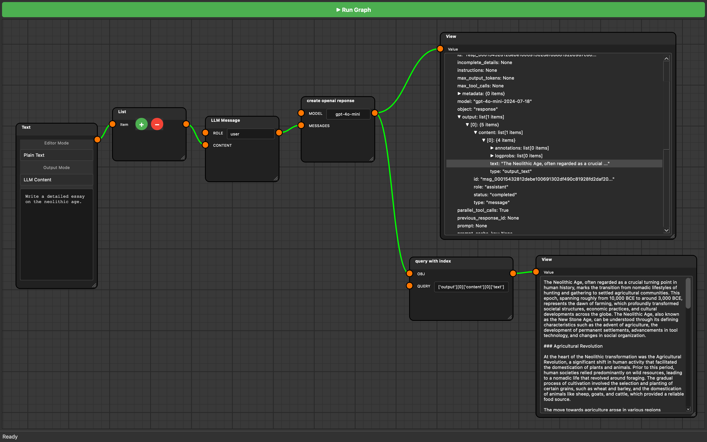
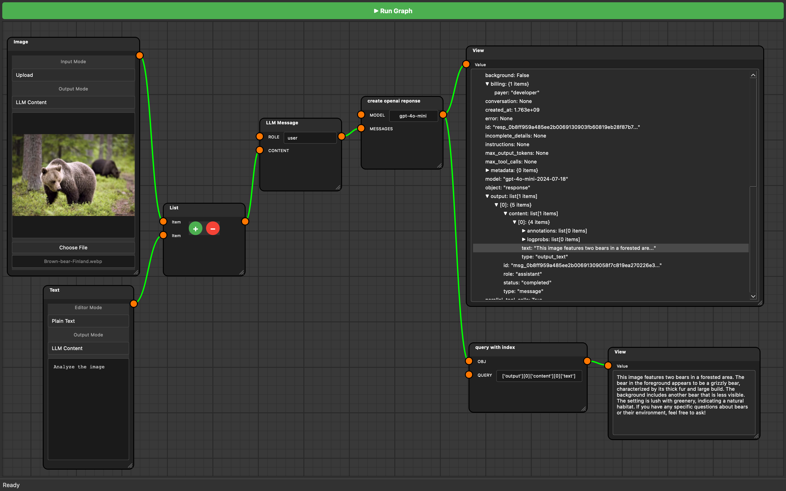

# OpenAI Workflows

## OpenAI LLM Response

This workflow demonstrates how to use the OpenAI LLM SDK to generate a response to a user's message.

[ :material-download: Download Workflow](../assets/workflows/openai-llm-response.json){ .md-button .md-button--primary }

???+ note
    - Make sure that you have the `OPENAI_API_KEY` environment variable set in preferences.
    - Make sure that the output mode in the `Text` Node is set to `LLM Content`.
    - The exact index to access the response from a non-reasoning OpenAI response is `['output'][0]['content'][0]['text']`. This is the value that you need to pass to the `query with index` node.

## OpenAI Vision Response

This workflow demonstrates how to use the OpenAI to generate a response to a user's message to use the vision capabilities of an LLM.

[ :material-download: Download Workflow](../assets/workflows/openai-vision-response.json){ .md-button .md-button--primary }

???+ note
    - Make sure that you have the `OPENAI_API_KEY` environment variable set in preferences.
    - Make sure that the output mode in the `Text` and `Image` Nodes is set to `LLM Content`.
    - The exact index to access the response from a non-reasoning OpenAI response is `['output'][0]['content'][0]['text']`. This is the value that you need to pass to the `query with index` node.

